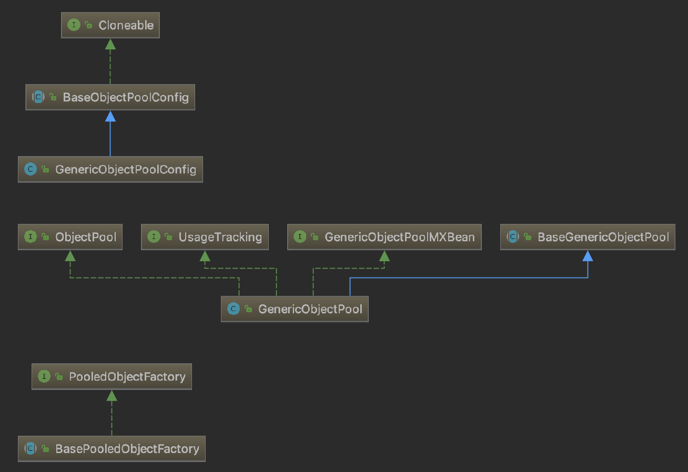

# Redis

参考：  
《Redis设计与实现》  
Jedis Client API: https://github.com/xetorthio/jedis (包含了jedis源码[位于src文件夹]和使用代码[位于test文件夹])  
https://blog.csdn.net/kingcat666/article/details/77936970 Java Jedis操作Redis示例（四）——Redis和Mysql的结合方案演进  

Redis实际中高级应用细节也很多的，网上也没有总结实际应用的源码，非一朝一夕，慢慢积累吧，后面将每一种应用场景都实现一下，加深记忆和理解！

Redis基础知识有道云笔记路径：web后端->web后端分层->数据持久层->Redis  
《Redis教程》(Redis应用场景、优缺点（或者说与其他数据库的不同点）、安装启动测试、命令行操作[数据库连接、Redis五种数据类型、
键的管理、五种数据类型的键值对增删改查等操作])  
《Redis实现原理》

## Redis 的应用场景
每个东西被开发出来肯定是为了解决一些问题，或简化或优化一些东西，展示出来就是和其他同类框架不一样的功能或特点。

+ 缓存（数据的查询，新闻，商品的内容，聊天室软件的好友列表）  
    所谓缓存是临时创建用于增加访问速度的数据，比较耗时且不频繁变动的存取操作就比较适合放进缓存。  
+ 任务队列或者叫缓冲（抢购）  
+ 网站访问统计  
    有自增计数  
+ 数据过期策略与内存淘汰机制 （Session自动清理）  
    Redis采用定期删除与懒惰删除策略（定期删除：数据虽然过期，但是我不真的立即删除，到一定的时间（100ms一周期）等要删的数据积累的差不多了
    随机检查几个key是否过期然后删除，这样容易积累很多过期数据；然后采用懒惰删除策略在获取key的时候再检查一次是否过期，过期了就立即删了），
    这个策略还是有问题的，需要再配合内存淘汰机制（6中策略机制）  
    因为过期管理功能常用于 Session 的缓存，当Session过期的时候，自动清理 Session 数据，免于手动管理。
+ 分布式集群架构中的session分离

+ Redis与MySQL配合使用，互相弥补不足  
    Redis的特点读写速度快，MySQL相对于Redis优点是存储数据量大，可以存储关系复杂的数据（所以MySQL中关系简单且读写频繁的数据都可以交给Redis处理，然后更新到MySQL）；  
    Redis作为MySQL缓存需要面对数据一致性的问题。  

不同数据类型的应用场景
+ String  
    一些复杂的计数功能的缓存  
+ Hash  
    存放结构化数据的场景  
+ List  
    实现消息队列的功能  
    通过lrange命令做分页功能  
+ Set  
    全局去重的功能；获取共同关注的功能（取交集，如果是关系型数据库要先join,然后distinct,比较麻烦）    
    交集、并集、差集计算共同点，全部特点，独有的特点等  
+ Sorted Set  
    通过权重参数做排行榜应用  

## Java命令行应用使用Redis
笔记《Redis教程》中提到的命令行操作，都有对应的Jedis接口。

#### 引入依赖
```
<dependency>
    <groupId>redis.clients</groupId>
    <artifactId>jedis</artifactId>
    <version>2.9.0</version>
    <type>jar</type>
    <scope>compile</scope>
</dependency>
```

#### Jedis基本操作
查看测试代码 test/java/top/kwseeker/commandline/CommandLineAppTest.java

+ 连接  
    Class: redis.clients.jedis.Connection  

    涉及问题：  
    Jedis连接设置与方式、连哪个数据库、认证等问题；

    每个连接都包含以下配置项,连接基于Socket实现，支持SSL连接；  
    ```
    host: "localhost"(default)
    port: "6379"(default)
    connectionTimeout: 2000(default)
    soTimeout: 2000(default)    //读取输入流的超时时间ms
    ssl: false(default)
    ``` 

    SSL连接

    连接方式（通过Jedis对象连接、JedisPool连接、Jedis集群连接）

    连接哪个数据库  
    使用Jedis.select()方法，集群部署中select()是无效的，因为默认使用db0。

    非本地连接的认证处理  
    使用Jedis.auth()方法。
    
#### Redis部署模式及Jedis连接

+ Redis单实例（Jedis）

    Redis服务端只部署在一个服务器的某个端口上；
    
    可以使用Jedis类也可以使用JedisPool连接。JedisPool是连接池的概念用于并发环境下和其他池的作用一样，复用连接，
    减少不必要的连接创建和销毁的操作。
    
    - 源码分析JedisPool实现原理
    
        JedisPool 依赖于 Apache commons-pool2 中对象池的实现。
        首先研究一下 commons-pool2 的对象池的实现原理。
        
        * Apache Common-pool2 对象池技术
            
            Common-pool2是一个通用的对象池技术实现，可以很方便用来实现自己的对象池，除了Redis，
            其他框架如DBCP也有使用Common-pool2实现自己的对象池。
            
            Eviction 翻译为驱逐，在这里可能更合适。
            
            适用场景：线程、网络连接、数据库连接等。
            
            分析 Commons-pool2 首先从一个简单的Demo开始。参考测试代码 top.kwseeker.tests.pool.CommonPool2Test。
               
            GenericObjectPool 是对象池的主体实现，  
            GenericObjectPoolConfig 是对象池配置，  
            BasePooledObjectFactory 是抽象类由用户实现具体方法，用于创建存储于对象池的对象。  
            IdentityWrapper 本质上是PooledObject对象的Hash索引。  
            DefaultPooledObject 池化对象实现，只是添加了一些记录池化操作的属性。  
            PooledObjectState 池化对象状态（IDLE：空闲，ALLOCATED：使用中，EVICTION：正在检测泄漏可能被回收，
                EVICTION_RETURN_TO_HEAD, VALIDATION, VALIDATION_PREALLOCATED, VALIDATION_RETURN_TO_HEAD, 
                INVALID, ABANDONED, RETURNING）  
            
            池化对象的状态转换（TODO：这个状态转换是对象池工作流程的剪影）  
            
            
            GenericObjectPool
            ```
            // 
            private volatile String factoryType = null;
            // 最大空闲对象数(default:8)
            private volatile int maxIdle = GenericObjectPoolConfig.DEFAULT_MAX_IDLE;
            // 最小空闲对象数(default:0)
            private volatile int minIdle = GenericObjectPoolConfig.DEFAULT_MIN_IDLE;
            // 池化对象工厂
            private final PooledObjectFactory<T> factory;
            // 创建的所有的池化对象都存储在ConcurrentHashMap中
            private final Map<IdentityWrapper<T>, PooledObject<T>> allObjects = new ConcurrentHashMap<IdentityWrapper<T>, PooledObject<T>>();
            // 创建对象计数，每创建一个对象+1
            private final AtomicLong createCount = new AtomicLong(0);
            // 所有空闲的对象存储在 LinkedBlockingDeque 中
            private final LinkedBlockingDeque<PooledObject<T>> idleObjects;
            // 泄漏清理操作的配置（泄漏判断时间removeAbandonedTimeout单位s）（默认null）
            private volatile AbandonedConfig abandonedConfig = null;
            
            // Configuration attributes
            // 最大对象数
            private volatile int maxTotal = GenericKeyedObjectPoolConfig.DEFAULT_MAX_TOTAL;
            // 对象用尽是否阻塞，不阻塞的化应该回返回异常
            private volatile boolean blockWhenExhausted = BaseObjectPoolConfig.DEFAULT_BLOCK_WHEN_EXHAUSTED;
            // 阻塞等待获取对象的时间 -1 无限等待
            private volatile long maxWaitMillis = BaseObjectPoolConfig.DEFAULT_MAX_WAIT_MILLIS;
            // 默认后进先出
            private volatile boolean lifo = BaseObjectPoolConfig.DEFAULT_LIFO;
            // 默认非公平模式
            private final boolean fairness;
            
            // 对象创建时测试（default:false）
            private volatile boolean testOnCreate = BaseObjectPoolConfig.DEFAULT_TEST_ON_CREATE;
            // 对象被引用时测试
            private volatile boolean testOnBorrow = BaseObjectPoolConfig.DEFAULT_TEST_ON_BORROW;
            // 对象被返回时测试
            private volatile boolean testOnReturn = BaseObjectPoolConfig.DEFAULT_TEST_ON_RETURN;
            // 对象闲置时测试
            private volatile boolean testWhileIdle = BaseObjectPoolConfig.DEFAULT_TEST_WHILE_IDLE;
            // 对象回收线程执行间隔，-1表示不执行回收线程
            private volatile long timeBetweenEvictionRunsMillis = BaseObjectPoolConfig.DEFAULT_TIME_BETWEEN_EVICTION_RUNS_MILLIS;
            // 每次执行回收测试的次数 3
            private volatile int numTestsPerEvictionRun = BaseObjectPoolConfig.DEFAULT_NUM_TESTS_PER_EVICTION_RUN;
            //
            private volatile long minEvictableIdleTimeMillis = BaseObjectPoolConfig.DEFAULT_MIN_EVICTABLE_IDLE_TIME_MILLIS;
            //
            private volatile long softMinEvictableIdleTimeMillis = BaseObjectPoolConfig.DEFAULT_SOFT_MIN_EVICTABLE_IDLE_TIME_MILLIS;
            // 对象回收策略
            private volatile EvictionPolicy<T> evictionPolicy;
            
            final Object closeLock = new Object();
            //对象池关闭状态（默认false，未关闭）
            volatile boolean closed = false;
            final Object evictionLock = new Object();
            //回收线程，异步执行
            private Evictor evictor = null; // @GuardedBy("evictionLock")
            //空闲对象的迭代器
            EvictionIterator evictionIterator = null; // @GuardedBy("evictionLock")
            private final WeakReference<ClassLoader> factoryClassLoader;
        
            // Monitoring (primarily JMX) attributes
            private final ObjectName oname;
            private final String creationStackTrace;
            private final AtomicLong borrowedCount = new AtomicLong(0);
            private final AtomicLong returnedCount = new AtomicLong(0);
            final AtomicLong createdCount = new AtomicLong(0);
            final AtomicLong destroyedCount = new AtomicLong(0);
            final AtomicLong destroyedByEvictorCount = new AtomicLong(0);
            final AtomicLong destroyedByBorrowValidationCount = new AtomicLong(0);
            private final StatsStore activeTimes = new StatsStore(MEAN_TIMING_STATS_CACHE_SIZE);
            private final StatsStore idleTimes = new StatsStore(MEAN_TIMING_STATS_CACHE_SIZE);
            private final StatsStore waitTimes = new StatsStore(MEAN_TIMING_STATS_CACHE_SIZE);
            private final AtomicLong maxBorrowWaitTimeMillis = new AtomicLong(0L);
            private volatile SwallowedExceptionListener swallowedExceptionListener = null;
            ```
            
            1）对象池初始化  
                开启JMX监控；初始化将要池化的对象容器；设置一些配置项；设置并启动泄漏回收器。
            
            2）borrowObject()  
                2.1) 校验一下池是否开启(初始化后默认开启)；  
                2.2) 如果设置了泄漏清理配置，且使能了当从池中借用对象的时候检测泄漏清理的标志，则判断当前空闲对象是否快被用完以及激活数是否快达到池的最大容量，
                是的化则执行检测回收操作；  
                3.3) 从池中取对象，
                     blockWhenExhausted = true, 从idleObjects（LinkedBlockingDeque）中 pollFirst(),取不到就"尝试"创建一个池化对象；
                     如果还是取不到，则阻塞等待直到双端队列中有对象可取或者超时，对于有超时等待的取超时取不到抛异常；
                     取成功后要修改池化对象DefaultPooledObject的状态标志。
                     blockWhenExhausted = false, 没有上面阻塞等待获取的过程，其他都一样。  
                3.4) 设置一下后续的状态标志。  
        
            3）returnObject()  
                3.1) 获取对象状态并检查，不是ALLOCATED，抛出异常；  
                3.2) 修改对象状态为RETURNING；  
                3.3) 如果设置了testOnReturn = true，还需要通过validateObject()校验对象的有效性；  
                3.4) 修改其他一些状态标志；  
                3.5) 将对象放回idleObjects队列中（不是allObjects队列），放入头部还是尾部，有lifo决定。
                     注意对象的取出放回并不是向队列添加或删除，而是设置标示取出或放回的状态。  
                
        * JMX（Java Management Extensions， TODO：深入研究使用方法）
        
            是一个监控管理资源的框架。通过JMX的MBean可以看到JVM中运行的组件的一些属性和操作。
            例如，可以看到Tomcat 8080端口Connector的请求连接池信息，Druid数据库连接池的activeCount连接数以及连接池配置信息，
            这些开源框架或中间件都是通过JMX的方式将自己的一些管理和监控信息暴露给我们的。
            常用于管理线程，内存，日志Level，服务重启，系统环境等。
            
            由于它是标准Java的拓展库，所以可以用于任何Java程序。
            
            工作原理可以理解为在Java应用中启动了一个应用监控管理服务，通过一定规则可以将想要监控的资源注册到这个服务中
            然后可以通过JConsole等作为客户端，监控应用实时运行时内部数据状态。也可以修改程序资源状态。
            
            JMX在Common-pool2中的作用：            
            
            参考资料
            [JMX Document](https://www.oracle.com/technetwork/java/javase/tech/docs-jsp-135989.html)
            [Java Management Extensions (JMX) - Best Practices](https://www.oracle.com/technetwork/java/javase/tech/best-practices-jsp-136021.html)
            [开源框架是如何通过JMX来做监控的(一) - JMX简介和Standard MBean](https://www.cnblogs.com/trust-freedom/p/6842332.html)
            
        * JedisPool工作流程  
            
            JedisPool相对于GenericObjectPool数据结构没有改变，只是额外封装了些方法而已。
        
            ```
            final JedisPoolConfig config = new JedisPoolConfig();
            //继承关系
            JedisPoolConfig
                -> GenericObjectPoolConfig
                    -> BaseObjectPoolConfig
                        -> Cloneable
            JedisPool 
                -> Pool (内部有GenericObjectPool成员变量)
            JedisFactory
                -> PooledObjectFactory<Jedis>
            ```
            JedisPoolConfig 继承 GenericObjectPoolConfig，数据结构没有变，只是构造函数初始化了几个配置参数;
            JedisPool继承抽象类Pool，Pool维持了GenericObjectPool类型的成员变量，数据结构也没有拓展；
            JedisPool只是封装了一些方法。
            
            JedisPool使用
            ```
            final JedisPoolConfig config = new JedisPoolConfig();
            final JedisPool jedisPool1 = new JedisPool(config, ConnectionSetting.host); //Jedis实例工厂对象的创建封装到JedisPool构造方法中了
            Jedis jedisTemp = jedisPool.getResource();  //borrowObject()
            jedisTemp.close()   //returnObject()
            ```
    
+ Redis分布式数据分片（ShardedJedis）
    
    Redis服务端有多个实例，可能部署在多个服务器多个端口上；但是服务之间没有互相关联；
    实现数据分片是通过客户端的算法实现的。
    
    ShardedJedis 也有池的形式 ShardedJedisPool，用法和JedisPool类似。
    
    - 源码分析Jedis分片算法原理
    
        以常用的ShardedJedisPool分析，主要是分析ShardedJedis是怎么索引多个分片对应的很多连接实例中的一个的；
        
        由于ShardedJedisPool本质上是GenericObjectPool，       
        首先看ShardedJedisPool初始化过程中分片与连接实例初始化流程（即ShardedJedisFactory添加池化对象的流程）
        ```
        private void initialize(List<S> shards) {
            nodes = new TreeMap<Long, S>();
        
            //为每个分片创建（160*权重）个虚拟节点，存放在nodes中，实际的连接实例每个分片只有一个是在resources中存储。
            for (int i = 0; i != shards.size(); ++i) {
              final S shardInfo = shards.get(i);
              if (shardInfo.getName() == null) for (int n = 0; n < 160 * shardInfo.getWeight(); n++) {
                nodes.put(this.algo.hash("SHARD-" + i + "-NODE-" + n), shardInfo);
              }
              else for (int n = 0; n < 160 * shardInfo.getWeight(); n++) {
                nodes.put(this.algo.hash(shardInfo.getName() + "*" + shardInfo.getWeight() + n), shardInfo);
              }
              resources.put(shardInfo, shardInfo.createResource());
            }
        }
        ```
        
        然后看getResource()，结果发现就是GenericObjectPool的borrowObject(), 结合前面的分析知道只是从池中取或者新建ShardedJedis实例；  
        但是需要注意一点，最后 jedis.setDataSource(this); 说明所有ShardedJedis内部的dataSource都是指向的同一个ShardedJedis对象池。
        
        然后是通过ShardedJedis操作Redis，首先需要根据算法获取一个连接实例，即Jedis实例；
        ```
        //通过下面分析可以知道这里是取redis键key通过Hash算法（MURMUR_HASH或指定其他算法）求出的分界点后第一个nodes的Hash键；
        //然后根据这个键对应的节点名称，再去resource中取真正的Jedis实例。
        resources.get(getShardInfo(key));
        
        public S getShardInfo(byte[] key) {
            //以key为值通过Hash算法获取临界点，获取tailMap
            SortedMap<Long, S> tail = nodes.tailMap(algo.hash(key));
            if (tail.isEmpty()) {
              return nodes.get(nodes.firstKey());
            }
            //tailMap不为空则获取红黑树中第一个Hash键。
            return tail.get(tail.firstKey());
        }
        ```
        
        总结：ShardedJedis中有两个成员变量nodes(TreeMap)和resources（LinkedHashMap），nodes用于存储通过MURMUR_HASH算法
        算出的Hash（键）与分片信息（值）映射，每个分片有160*权重个虚拟节点，操作redis时需要先通过keymd5Holder计算Hash值，然后在
        虚拟节点中通过这个Hash值获取TailMap第一个Hash值，通过这个Hash值可以获取分片名字，继而可以通过分片名字在resouces中
        检索到对应的连接实例（Jedis实例）。
        
        网上的好多资料说什么哈希环？这个结构从哪来的？Redis的分片结构是红黑树啊，难道是为了好理解简化为了环？
        
    - MURMUR_HASH
        
        MURMUR_HASH就是一致性哈希算法，具有高性能，低碰撞的特点；广泛应用于Hadoop、Nginx、libmemcached 等开源系统中。
        
+ Redis集群（JedisCluster）

    Redis服务端有多个实例，可能部署在多个服务器多个端口上，且服务之间做好了相互关联，实现了诸如数据分片，主从，监控等功能；
    只需要部署时配置好即可。
    
    - 哈希桶原理
    
    - 哈希桶与一致性哈希算法对比
    
    - 项目中应该选择分片还是集群

#### Redis过期策略

## Spring应用集成Redis

#### 集成Redis方法
Spring MVC 可以添加依赖 spring-data-redis  
Spring Boot 可以添加依赖 spring-boot-starter-redis

#### Jedis集群

#### 实际应用案例

+ 拦截器与Redis配合实现网站访问计数

+ 作为MySQl的数据缓存


