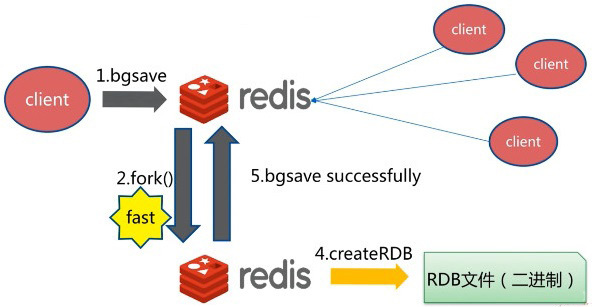

# Redis系统认知

知识学过之后感觉很零散，还经常忘,很多资料也从来没有从设计思想层面系统讲解过Redis设计。但是要形成长期记忆必须将知识串起来，理解设计始末；下面从设计思想角度按自己的理解重新整合下Redis的内容。

持续更新中...

推荐资料:  
《Redis in action / Redis实战》：列举了很多实际应用场景,结合自己项目中需求可能汲取到一些实现建议，适合根据这本书里面的应用场景实操；  
《Redis设计与实现》: 从实现原理角度分析Redis设计思想。   
《Redis深度历险 核心原理与应用实践》：列举了比较重要的部分的应用和原理。  
《官方文档 https://redis.io　、http://www.redis.cn》：其他的书感觉不如读官方文档，当作手册使用。  
[Redis源码](https://github.com/antirez/redis)  
[如何阅读 Redis 源码](http://blog.huangz.me/diary/2014/how-to-read-redis-source-code.html)  
最重要的命令: `config get *`

逻辑：  
1. 支持存储哪些数据类型，怎么存储的，怎么做到访问高性能的？
2. 作为内存存储数据库，数据超过存储上限怎么办？内存数据在断电宕机等情况可能存在数据丢失怎么解决？


[TOC]

## Redis定位

键值数据库、高速缓存、消息中间件（这个有点牵强）。

### 键值对如何存储

首先作为一个键值数据库需要最少要实现基本的CRUD。
那么数据键值对数据使用什么数据结构存储？

#### 键值对的存储

SDS(Redis没有使用C语言传统的字符串存储字符串而是定义了一个struct)简单动态字符串;
```C
//类似java ArrayList
struct sdshdr {
  int len;
  int free;
  char buf[];
}
```

key的存储：底层是在SDS中保存, 比如`set name lee`,　redis里面就有个
sdshdr变量buf中存着"name";

value的存储(典型的存储结构，但是不仅仅限于这几种，详细参考《Redis设计与实现》表8-4):  
**String类型**：也是使用SDS变量存储；  
**List类型**：外边看是一个Ｃ语言实现的双向链表，而每个节点是SDS变量；  
**Hash类型**：存储类似Java HashMap,很多key-value,存储结构是Hash桶，每个key、value是SDS变量；
```
hset kwseeker name lee age 26 
```
**Set类型**：存储类似Java HashSet（key插入时要判断是否重复，value是一个固定的Object对象）,每个key是SDS, value是null。  
如果一个集合中只包含整数值元素，并且这个集合的元素不多时,Redis就会使用整数集合(intset)作为该集合的底层实现。
```
typedef struct intset{
  //编码方式
  uint32_t encoding;
  //集合包含的元素数量
  uint32_t length;
  //保存元素的数组
  int8_t contents[];
}intset;
```

**ZSet类型**：存储基于hash字典＋跳表（既是hash字典又是跳表），hash字典的key是SDS，一方面保证了内部 value 的唯一性,另一方面它可以给每个 value 赋予一个 score ,代表这个 value 的排序权重。
```java
struct zsl {
  //跳表
  zslnode* header;
  //跳表当前的最高层
  int maxLevel;
  //hash表
  map<string, zslnode 与 ht;
}
```
知道了key value分别是怎么存储的，那么key value是怎么关联起来的？又是什么数据结构？

key-value是用字典实现的,本质是hash表，就是类似java HashMap / Hashtable 的结构。

Redis字典的hash表的实现估计是借鉴了高等语言的容器类，也包含扩容等操作。

最终数据在Redis存储的样子是这样的：
```
redis> SET message "hello world"
redis> RPUSH alphabet "a" "b" "c"
redis> HSET book name "Redis in Action"
redis> HSET book author "Josiah L.Carlson"
redis> HSET book publisher "manning"
```


redisDb的结构
```C
typedef struct redisDb {
    //键空间字典，用于存储及索引键对应的值
    dict *dict;                 /* The keyspace for this DB */
    //保存键空间中包含过期时间的键和过期时间
    dict *expires;              /* Timeout of keys with a timeout set */
    dict *blocking_keys;        /* Keys with clients waiting for data (BLPOP)*/
    dict *ready_keys;           /* Blocked keys that received a PUSH */
    dict *watched_keys;         /* WATCHED keys for MULTI/EXEC CAS */
    int id;                     /* Database ID */
    long long avg_ttl;          /* Average TTL, just for stats */
    unsigned long expires_cursor; /* Cursor of the active expire cycle. */
    list *defrag_later;         /* List of key names to attempt to defrag one by one, gradually. */
} redisDb;
```

PS: 关于跳表,在数据结构与算法仓库中讲解,提供了Java实现版本。

#### 对象与基于引用计数的内存回收机制

为何在前面的基础类型之上又重新封装一层，封装成对象？

基于上面的数据结构创建了一个对象系统。对象系统作用：  
１）执行命令之前可以根据对象的类型来判断一个对象是否可以执行给定的命令。  
２）针对不同使用场景为对象设置多种不同的数据结构实现，优化对象在不同场景下的使用效率。

```C
typedef struct redisObject {
    //对象类型：REDIS_STRING REDIS_LIST REDIS_HASH REDIS_SET REDIS_ZSET 
    unsigned type:4;
    //编码（底层数据结构类型编码）
    unsigned encoding:4;
    //应该是删除策略使用的？
    unsigned lru:LRU_BITS; /* LRU time (relative to global lru_clock) or
                            * LFU data (least significant 8 bits frequency
                            * and most significant 16 bits access time). */
    //引用计数，用于实现自动回收
    int refcount;
    //底层数据结构，就是上一小节讲的各种类型数据结构
    void *ptr;
} robj;
```

Redis对键和值分别定义一个对象，键总是字符串对象，值则有很多数据结构类型，并不限于上面的５种。  
总地来说是对整型数据做了优化。


TODO: 使用Redis对象及不同数据结构具体有哪些好处（书上也没有说清具体有什么好处）？或者Redis为什么要对整型数据进行存储优化？

##### Redis使用的内存存储，势必不能存储大量数据，当缓存已满如何处理

最大内存存储可以在redis.conf中设置，或通过`CONFIG SET`设置：
```
maxmemory 100mb
```

Redis针对这种情况有６种淘汰策略(maxmemory-policy,主要分为对设置了expire的键和allkey)，按使用热度排列：  
```
volatile-lru      //针对设置了超时时间的键，删除最近最少使用的键
allkeys-lru       //针对所有的键，删除最近最少使用的键
volatile-ttl      //针对设置了超时时间的键，删除快要过期的键
volatile-random   //针对设置了超时时间的键，随机删除
allkeys-random    //针对所有的键，随机删除
noeviction        //不删除，达到最大内存限制直接返回错误
```

如何合理选择策略：通过INFO命令监控缓存命中率。

#### 键值对的基本操作原理

##### C、S建立连接到发送指令再到数据写入内存的流程

+ ++前期准备++

  下载Redis源码，找到代码入口；
  ```shell
  grep -rins "main(" ./redis/src
  ```
  找到如下结果
  ```shell
  # 客户端入口
  ./redis-cli.c:7884:int main(int argc, char **argv) {
  #
  ./dict.c:1184:int main(int argc, char **argv) {
  #
  ./sds.c:1297:int main(void) {
  #
  ./siphash.c:351:int main(void) {
  #
  ./redis-benchmark.c:1475:int main(int argc, const char **argv) {
  #
  ./localtime.c:109:int main(void) {
  # 服务端入口
  ./server.c:4889:int main(int argc, char **argv) {
  ```

+ ++CS连接++  

  Jedis客户端和Redis服务器通过基于TCP实现的RESP协议实现连接交互。

  TODO: RESP协议原理？


+ ++Redis-server解析收到指令并执行++

  Redis-server中据说使用到IO多路复用，那么应该就是在建立连接之后处理请求这部分。

##### 排序

#### 事务的实现（不推荐用无法回滚）

Redis 的事务是通过 MULTI（事务开启，之后的命令会进入队列） 、 EXEC（执行队列中命令） 、 
DISCARD（清除队列中所有命令,以及MULTI） 和 WATCH（设置监控，监控目标key是否改变，UNWATCH清除所有监控） 这四个命令来完成的；  
每个命令都是原子性的，且Redis是单进程单线程的(执行事务时不会出现竞争，如果是集群呢多个Master?(同样不存在竞争因为数据在Master间分片存储))。

客户端１：
```sh
localhost:6381> multi
OK
localhost:6381> set s1 111
QUEUED
localhost:6381> hset kwseeker name lee
QUEUED
localhost:6381> hset kwseeker job programmer
QUEUED
localhost:6381> exec
1) OK
2) (integer) 1
3) (integer) 1
```
客户端２：
```
localhost:6382> watch s1
OK
```

EXEC返回一个list,存储事务中每个子命令的执行返回，如果事务失败则返回空的list(注意不是返回null)。

通过Redis事务可以实现Redis乐观锁（WATCH监听版本号）。

### 作为一个高速缓存如何提升访问效率

#### 事件驱动模型

### 作为服务总也绕不开的数据安全和高可用如何保证

#### [数据安全：持久化](https://redis.io/topics/persistence)

由于Redis是内存数据库，为了防止断电、宕机等问题导致数据丢失，需要做数据持久化，保存到硬盘；  
Redis-server每次启动会先加载.rdb文件，将数据加载到内存中。

##### RDB（默认持久化方式）

将当前数据生成.rdb快照保存到硬盘；有两个命令`save`和`bgsave`，支持手动和自动:

save使用主进程进行持久化，会阻塞其他操作。
```
//设置快照文件 dump.rdb 存储位置
//也可在redis.conf中配置　
//  dbfilename dump.rdb
//  dir /usr/local
redis> config set dbfilename dump.rdb
redis> config set dir /usr/local
redis> save
```


bgsave会新创建一个线程，在这个线程中完成持久化操作。
```
redis> bgsave
```

##### AOF

存储命令而不是数据，和MySQL binlog类似。
分为两个步骤：   
1）write:将命令写入AOF文件(在内存中)（这个过程其实不怎么耗时，因为是内存读写）;  
2）save:将AOF文件保存到磁盘（这个过程比较耗时，因为涉及磁盘IO，后面的三种策略也主要是针对这个阶段做优化）。  

+ AOF_FSYNC_NO

  写入和保存都由主进程执行,但是保存操作只会在AOF 关闭或 Redis 关闭时执行，或者由操作系统触发（即save操作很少）。  
  但是不安全。

+ AOF_FSYNC_EVERYSEC

  写入操作由主进程执行。保存操作由子线程执行,不阻塞主进程,但保存操作完成的快慢会影响写入操作的阻塞时长（即保存会阻塞写入）。  
  平衡性能和安全性(最多丢失两秒的数据)。

+ AOF_FSYNC_ALWAYS

  写入和保存都由主进程执行，写完立即保存，存在大量磁盘IO,性能低。

开启AOF持久化,redis.conf中配置
```
appendonly yes
appendfilename "appendfilename.aof"
//持久化策略
appendsync always   //每次有新命令都会追加到aof文件中,不会丢失数据、安全，但性能低
appendsync everysec //每秒向aof文件中存储一下这秒中的命令，折中性能和数据安全,最多可能丢失１s的数据
appendsync no
```

AOF重写：  

当AOF文件体积超过配置中设定值或者超过上次重写后大小的一倍，则触发后台重写，
只保留最小命令集合。

AOF重写使用子进程，子进程保存有AOF数据副本，同时主进程会在子进程启动后，同时将命令写入到重写缓存，
子进程重写完成后替换原AOF文件，并将重写缓存中的命令追加到新的AOF文件。

##### RDB与AOF对比

根据数据是否容许丢失选择持久化模式。如果只是做缓存直接使用RDB即可。
如果是实时排名则应选择AOF，两者也可以同时使用，并不冲突。

RDB:  
全量数据（压缩二进制文件），恢复数据速度快；  
但是无法实时持久化，容易丢数据。  

AOF:  
相对RDB不容易丢失数据；保存了所有写入操作，文件可读；不用担心命令执行失败丢失数据；AOF文件；  
但是AOF文件比RDB更大；持久化效率比RDB慢；数据恢复慢。

#### 高可用：集群部署

##### 集群实现方案

+ **主从模式（淘汰）**

  Master写，Slave读；Master宕机，Slave无法切为Master导致不可用。需要手动将Slave切换为Master。

  + 设置
  
    redis.conf
    ```
    # 主从配置，将当前实例作为<masterip>:<masterport>的从机
    replicaof <masterip> <masterport>
    ```
    或者命令行
    ```
    ./redis-server ../redis7000.conf --slaveof 192.168.0.31 6379 &
    ```
    通过`info replication`可以查看主从状态。
      
  + 主从数据一致性与数据同步
  
    分为全量同步和增量同步。
    
    增量同步就是Master将接收到的命令转发给Slave一份；
  
    全量同步：同步快照阶段、同步写缓冲阶段、同步增量阶段（即上面的增量同步）。
    全量同步和前面说的AOF重写差不多，先拷个副本，再拷下处理副本期间缓冲的命令。

+ **哨兵模式**

  在主从模式基础上启动哨兵对所有节点进行监听。部署参考deploy中docker-compose.yml。

  监控集群中服务器状态，当主机挂掉之后，可以进行选举从从机中选举出一个新的主机。

  哨兵其实是代理，有哨兵时，客户端不再直接连接Redis节点，而是通过哨兵间接连接Redis节点。哨兵与Redis节点有心跳连接用于监控节点健康状态。

  故障迁移（raft算法）：  
  １）心跳失败（主观下线－>客观下线－>发起故障迁移）  
  ２）哨兵们选举
  
  哨兵模式有个缺点：
  当Master挂掉，哨兵选举新Master过程中无法正常处理数据，可能导致数据不一致。

+ **集群模式**

  Redis3.0之前并不支持服务端集群，当时为了部署集群，对数据进行分片，有两种解决方案：  
  １）由客户端实现分片逻辑（类比MySQL分库分表Sharding-JDBC）；  
  ２）添加proxy代理层（中间件，类比MySQL分库分表MyCat）,比如：Codis、twemproxy。  
  
  但是3.0之后Redis默认支持集群之后就不再使用上面两种方案了。  
  操作API的话，直接选用JedisCluster那套API。
  
  > JedisCluster不支持不同槽的多个key的批量操作；
  > 集群模式没有数据库的概念，不能select和flushdb;
  > key是分区最小粒度，一个key的数据不能映射到不同的节点。

  ShardedJedis 那套API应该就是基于客户端实现分片的。采用一致性Hash算法做数据分片。

  Redis3.0之后的集群模式，所有主节点互联、主节点和各自的从节点相连。主从间保证高可用，主主间保证高拓展。
  采用Hash槽（crc16哈希取余）做数据分片。最多支持拓展16384个节点[一个节点一个槽]。
  
  > Redis 集群中内置了 16384个哈希槽,当需要在 Redis 集群中放置一个 key-value 时,redis 先对
  > key 使用 crc16 算法算出一个结果,然后把结果对 16384 求余数,这样每个 key 都会对应一个编号在
  > 0-16383 之间的哈希槽,redis 会根据节点数量大致均等的将哈希槽映射到不同的节点

  集群节点间采用Gossip协议进行通信（TODO）,维持心跳与节点信息同步。

  集群容错：其实和哨兵模式类似，和其他框架的模式也都类似（都基于差不多的理论）。
  
  只不过这里是所有的Master进行投票，决定某个异常的Master是否down了；以及应该选择
  down掉的Master的哪个Slave升级为Master。
  
  什么情况下集群会挂掉？  
  1）半数的主挂了,不能投票生效,则集群会挂掉；  
  2）某个主和它的所有从都挂了，slot槽不连续，则集群会挂掉。  
  
  ```sh
  redis-cli -h 127.0.0.1 -p 7001 -c   # -c 表示是以redis集群方式进行连接
  redis> cluster info                   # 查看集群状态
  redis> cluster nodes                  # 查看集群节点
  redis-cli --cluster add-node 127.0.0.1:7007 127.0.0.1:7001  # 添加新Master结点到127.0.0.1:7001所在集群
  redis-cli --cluster reshard 127.0.0.1:7007    # 为新节点分配hash槽
  redis-cli --cluster add-node 127.0.0.1:7008 127.0.0.1:7007 --cluster-slave 
    --cluster-master-id 50b073163bc4058e89d285dc5dfc42a0d1a222f2
  # 删除节点
  redis-cli --cluster del-node 127.0.0.1:7008 41592e62b83a8455f07f7797f1d5c071cffedb50
  ```
  
##### 数据一致性问题

##### 主服务器宕机重新选举、故障转移

### 其他功能

#### 消息的发布与订阅

#### 使用Lua脚本拓展功能

### Redis监控、问题分析与优化

#### 监控方案（监控客户端操作、集群性能）

### 生产应用中常见问题

#### 缓存击穿与缓存雪崩

缓存击穿：故意对Redis不存在的key进行高并发访问,导致数据库压力瞬间增大。  
解决方案：  
1）对查询结果为空的key也进行缓存，value为空值。后面如果再次使用此key,直接返回空值。
  但是这种方案无法应对key每次都不一样的恶意请求,而且会浪费大量内存空间；  
2）识别恶意请求，加入黑名单，拒绝此IP请求的访问；  
3）做限流处理（有可能在业务高峰期把正常的请求给限制了）;  
3）布隆过滤器。  
  布隆过滤器其实是用于做去重的。

缓存雪崩：当缓存服务器重启或者大量缓存集中在某一个时间段失效,这样在失效的时候,也会给后端系统(比如DB)带来很大压力。  
解决方案：  
1）将key的失效期分散开；  
2）添加二级缓存（比如Redis和数据库中间再设置一层缓存）；  
3）限流处理；  
4）搭建高可用集群，提升系统负载能力。  

#### 缓存与数据库数据一致性问题

如果只要求最终一致性，可以控制好缓存和数据库数据更新的顺序；  
如果要求强一致性，需要借助Cannal等工具实现数据同步。
