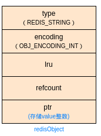
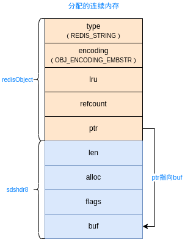
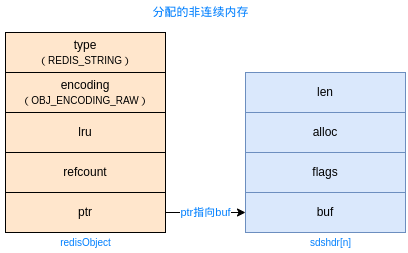
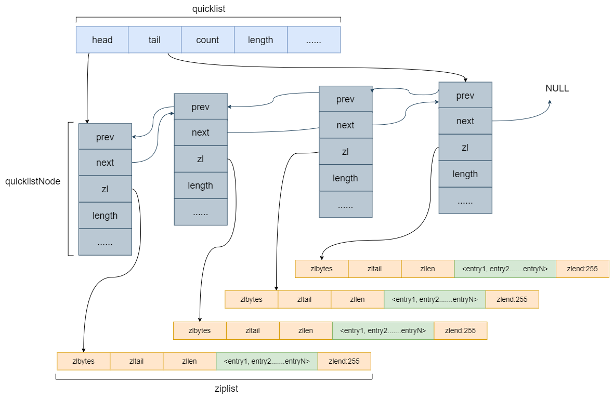
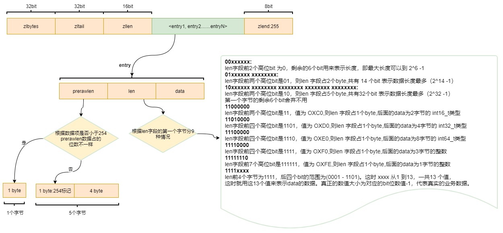
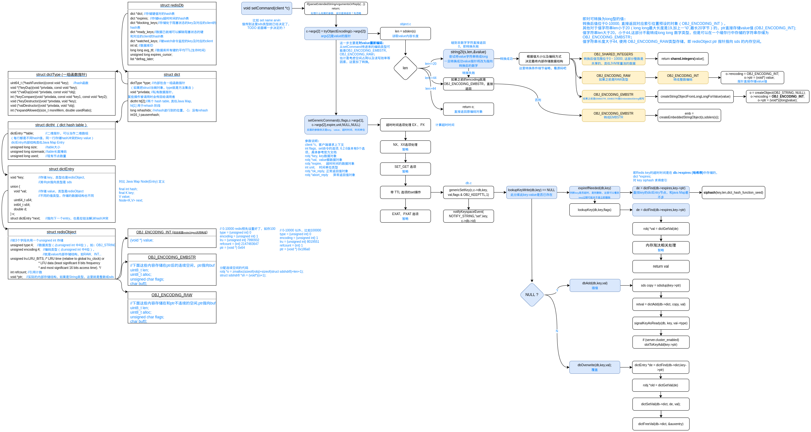
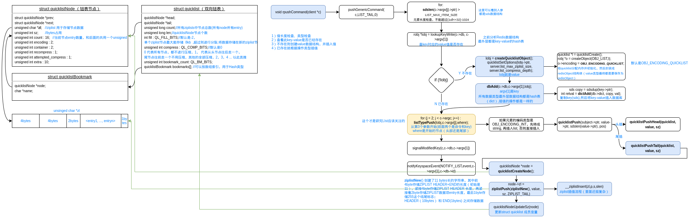

# Redis数据结构&内部实现原理

> 源码版本：Redis 6.2.6


## Redis数据类型与内部结构

### Redis数据类型

#### String、List、Set、ZSet、Hash

```C
#define OBJ_STRING 0    /* String object. */
#define OBJ_LIST 1      /* List object. */
#define OBJ_SET 2       /* Set object. */
#define OBJ_ZSET 3      /* Sorted set object. */
#define OBJ_HASH 4      /* Hash object. */
```

#### Bitmap

#### GenHash

#### HyperLogLog

#### Stream （5.0之后新增）


### **Redis重要结构体**


#### sds （Simple Dynamic String，5种类型）

是Redis自定义的字符串类型。

```C
//表面上看是个char指针类型，但是这里sds只是指向了sds的buf,通过指针下移一字节找到flag才能确定其真正的数据结构
typedef char *sds;
//typedef char *sds_buf;	//改成这个定义更好理解
```

索引为-1的位置上（flags）存储的是SDS的类型（有5中sds类型）:

```C
#define SDS_TYPE_5  0
#define SDS_TYPE_8  1
#define SDS_TYPE_16 2
#define SDS_TYPE_32 3
#define SDS_TYPE_64 4
#define SDS_TYPE_MASK 7

//1byte，flags低3位保存SDS类型，高5位保存字符串长度（最大长度63）
//buf是字符串内容
struct __attribute__ ((__packed__)) sdshdr5 {
    unsigned char flags; /* 3 lsb of type, and 5 msb of string length */
    char buf[];
};
//len: 1byte，低3位保存类型，高5位保存字符串长度，len是无符号char类型，即最大存储长度255
//alloc: 1byte, 用于记录还有多少空间可以使用 
//flag: 1byte，flags低3位保存SDS类型，高5位没有使用
//buf是字符串内容
struct __attribute__ ((__packed__)) sdshdr8 {
    uint8_t len; /* used */
    uint8_t alloc; /* excluding the header and null terminator */
    unsigned char flags; /* 3 lsb of type, 5 unused bits */
    char buf[];
};
//1byte，低3位保存类型，高5位保存字符串长度，len是无符号unsigned short int类型，即最大存储长度2^16-1
//1byte，flags低3位保存SDS类型，高5位没有使用
//buf是字符串内容
struct __attribute__ ((__packed__)) sdshdr16 {
    uint16_t len; /* used */
    uint16_t alloc; /* excluding the header and null terminator */
    unsigned char flags; /* 3 lsb of type, 5 unused bits */
    char buf[];
};
//1byte，低3位保存类型，高5位保存字符串长度，len是无符号unsigned int类型，即最大存储长度2^32-1
//1byte，flags低3位保存SDS类型，高5位没有使用
//buf是字符串内容
struct __attribute__ ((__packed__)) sdshdr32 {
    uint32_t len; /* used */
    uint32_t alloc; /* excluding the header and null terminator */
    unsigned char flags; /* 3 lsb of type, 5 unused bits */
    char buf[];
};
//1byte，低3位保存类型，高5位保存字符串长度，len是long long类型，即最大存储长度2^64-1
//1byte，flags低3位保存SDS类型，高5位没有使用
//buf是字符串内容
struct __attribute__ ((__packed__)) sdshdr64 {
    uint64_t len; /* used */
    uint64_t alloc; /* excluding the header and null terminator */
    unsigned char flags; /* 3 lsb of type, 5 unused bits */
    char buf[];
};
```

上面可以看到 flags 紧挨着 buf 定义，因为 robj 中 ptr 指针指向 buf , 要用 

```C
unsigned char flags = s[-1];
//将指针从buf向上移动，指向len,然后转换指针类型（如sdshdr8）
#define SDS_HDR(T,s) ((struct sdshdr##T *)((s)-(sizeof(struct sdshdr##T))))	//##是粘连符号
```

获取sds flag, 即SDS具体类型、甚至是字符串长度。


### Redis value 数据结构

```C
#define OBJ_ENCODING_RAW 0     /* Raw representation */
#define OBJ_ENCODING_INT 1     /* Encoded as integer */
#define OBJ_ENCODING_HT 2      /* Encoded as hash table */
#define OBJ_ENCODING_ZIPMAP 3  /* Encoded as zipmap */
#define OBJ_ENCODING_LINKEDLIST 4 /* No longer used: old list encoding. */
#define OBJ_ENCODING_ZIPLIST 5 /* Encoded as ziplist */
#define OBJ_ENCODING_INTSET 6  /* Encoded as intset */
#define OBJ_ENCODING_SKIPLIST 7  /* Encoded as skiplist */
#define OBJ_ENCODING_EMBSTR 8  /* Embedded sds string encoding */
#define OBJ_ENCODING_QUICKLIST 9 /* Encoded as linked list of ziplists */
#define OBJ_ENCODING_STREAM 10 /* Encoded as a radix tree of listpacks */
```

所有内部数据结构，最外层都是个redisObject。

查看对象内部编码数据结构类型：`object encoding key`。

#### INT

redisObject (详细介绍看下文) ptr 指针不存储地址，直接存储 value 转换后的数字；



0-10000 的值redis内部预先存储了，是可以共享使用的；

比如`set val 100` 这个100的存储结构是

```C
// 0-10000 redis预先设置好了，如存100
type = {unsigned int} 0
encoding = {unsigned int} 1
lru = {unsigned int} 7990932
refcount = {int} 2147483647
ptr = {void *} 0x64 
// 又比如100000
type = {unsigned int} 0
encoding = {unsigned int} 1
lru = {unsigned int} 8019551
refcount = {int} 1
ptr = {void *} 0x186a0 
```

#### EMBSTR



> 为何 EMBSTR 只能存储长度<=44的字符串？
>
> 内存IO每次访问数据的最小单位是缓存行（64byte），如果字符串长度足够小，完全可以只用一次IO完成 value 的访问，需要将redisObject 和 sdshdr8 存储到连续的内存，buf外其他字段占用总空间大小是 4+4+8+1+1+1=19, 留给buf 64-19=45bytes, 由于C语言数组存储字符串还要再最后存'\0'标识字符串结尾，占用1byte，最终最多只能存储长度为44的字符串。

#### RAW



相对于EMBSTR, RAW编码类型 redisObject 和 sds 存储在不连续的内存空间。

#### QUICKLIST



#### ZIPLIST



**ziplistNew**() 初始创建了11 bytes长的字符串，其中

zlbytes: 前4byte用于存储ZIPLIST总长度（初始是11bytes），

zltail: 紧接4byte存储最后一个数据项entry在ziplist中的偏移量（为了支持反向索引），

zlen: 再紧接着2byte存储ZIPLIST数据项entry长度，

zlend: 最后1byte存储255这个结尾标志；

HEADER（前10bytes） 和 END(最后1bytes) 之间存储数据。

prerawlen: 前一entry占用的数据长度（bytes，用于反向索引）；

len: 当前 entry 占用的数据长度以及数据类型。

> 数据存储紧凑，能转成整数的字符串会转成适当长度的整数存储。

#### HT

#### ZIPMAP

#### LINKEDLIST

#### INTSET

#### SKIPLIST

#### STREAM


### 数据类型与内部数据结构对应关系

| 外部数据类型 | 内部存储结构               |
| ------------ | -------------------------- |
| String       | INT / EMBSTR / RAW         |
| List         | QUICKLIST + ZIPLIST        |
| Set          | INTSET / HT                |
| ZSet         |                            |
| Hash         | ZIPLIST / HT (struct dict) |
| Bitmap       |                            |
| GenHash      |                            |
| HyperLogLog  |                            |
| Stream       |                            |


## String

以`set`命令为例。

```shell
SET key value [NX] [XX] [KEEPTTL] [GET] [EX <seconds>] [PX <milliseconds>] [EXAT <seconds-timestamp>][PXAT <milliseconds-timestamp>]
```

源码处理流程:

1. 调用栈

   ```c
   setCommand t_string.c:266	//进入string set 命令处理逻辑
   call server.c:3721
   processCommand server.c:4241
   processCommandAndResetClient networking.c:2039
   processInputBuffer networking.c:2140
   readQueryFromClient networking.c:2226
   callHandler connhelpers.h:79
   connSocketEventHandler connection.c:295
   aeProcessEvents ae.c:427
   aeMain ae.c:487				//event loop 监听客户端命令
   main server.c:6401
   ```

2. set命令处理分析

   代码不直观，所以根据源码逻辑画了个图 （流程图：redis-ds-process.drawio）

   
   
   hash算法 与 value索引：

   ```C
   uint64_t siphash(const uint8_t *in, const size_t inlen, const uint8_t *k) {
   	...
   }
   
   //从dict索引key对应的值（按key查超时时间、按key查value值 都是这个逻辑）
   h = dictHashKey(d, key);
   for (table = 0; table <= 1; table++) {
       idx = h & d->ht[table].sizemask;	//即按sizemask对key的hash值求模
       he = d->ht[table].table[idx];		//拉取一行(hash求模相同的所有key)
       while(he) {							//链表遍历，查找目标key
           if (key==he->key || dictCompareKeys(d, key, he->key))
               return he;
           he = he->next;
       }
       if (!dictIsRehashing(d)) return NULL;	//如果正在rehash,且在ht[0]中没有查找到key,再去ht[1]查一下，
       										//参考rehash机制
   }
   ```
   
   

## List

以`rpush`命令为例：

```shell
 RPUSH <key> <element> [<element> ...]
```

命令处理函数：

```C
void rpushCommand(client *c) 
```

源码 rpush 处理流程:



## Hash

以`hset`命令为例，命令处理函数：

```C
void hsetCommand(client *c)
```

处理流程和前面的都一样，不想画图了：

1. 先查最外层hash表key是否存在，存在则返回，不存在则创建Hash类value对象，然后将key-value存入选定数据库的最外层hash结构；

   ```C
   robj *o = lookupKeyWrite(c->db,key);
   o = createHashObject();	//value对象指针
   dbAdd(c->db,key,o);
   ```

   初始创建的 Hash value 对象也是 ziplist 数据结构。

   ```C
   unsigned char *zl = ziplistNew();//value对象的内部数据结构（*ptr）
   robj *o = createObject(OBJ_HASH, zl);
   o->encoding = OBJ_ENCODING_ZIPLIST;
   ```

   > ZIPLIST 数据结构决定了其索引效率很低，为何还能做Hash类型的内部数据结构？主要是源码限制了数据量很少的前提下才能用 ZIPLIST，后面有3个限制，任何一个条件不满足都会转成 HT 类型。
   >
   > 1）key value 单个参数字符串长度大于hash_max_ziplist_value (默认64bytes)
   >
   > 2）ZIPLIST 中 entry 数量超过 hash_max_ziplist_entries （默认512）
   >
   > 3）加上本次新增key value 存储总长超过1<<30字节，即1GB （有前两个条件限制这个其实根本无法出现）
   >
   > 搜索 hashTypeConvert(o, OBJ_ENCODING_HT) 这个方法都在哪里调用的，就能找到这三个限制条件。

2. 如果传入的key value参数，单个参数字符串长度大于64，或ziplist无法安全的新增数据（加上本次新增key value总长超过1<<30字节，即1GB， ？为何是1GB ？），将把 value 对象（redisObject指针）转成 **OBJ_ENCODING_HT** 类型；

   ```C
   void hashTypeConvertZiplist(robj *o, int enc) {
       serverAssert(o->encoding == OBJ_ENCODING_ZIPLIST);
   
       if (enc == OBJ_ENCODING_ZIPLIST) {
           /* Nothing to do... */
   
       } else if (enc == OBJ_ENCODING_HT) {
           hashTypeIterator *hi;
           dict *dict;
           int ret;
   
           hi = hashTypeInitIterator(o);
           dict = dictCreate(&hashDictType, NULL);	//为
   
           while (hashTypeNext(hi) != C_ERR) {
               sds key, value;
   
               key = hashTypeCurrentObjectNewSds(hi,OBJ_HASH_KEY);
               value = hashTypeCurrentObjectNewSds(hi,OBJ_HASH_VALUE);
               ret = dictAdd(dict, key, value);
               if (ret != DICT_OK) {
                   serverLogHexDump(LL_WARNING,"ziplist with dup elements dump",
                       o->ptr,ziplistBlobLen(o->ptr));
                   serverPanic("Ziplist corruption detected");
               }
           }
           hashTypeReleaseIterator(hi);
           zfree(o->ptr);
           o->encoding = OBJ_ENCODING_HT;
           o->ptr = dict;	//即内部数据结构也是 struct dict
       } else {
           serverPanic("Unknown hash encoding");
       }
   }
   ```

3. 将 value参数数据存入Hash value 对象。

   ```C
   int hashTypeSet(robj *o, sds field, sds value, int flags)
   ```

   

## Set

以`sadd`命令为例，命令处理函数：

```C
saddCommand(client *c)
```

源码处理流程：

外层数据结构处理还是一样，然后看内部数据结构：

```C
//value 数据结构创建
robj *setTypeCreate(sds value) {
    if (isSdsRepresentableAsLongLong(value,NULL) == C_OK)	//如果可以用整型表示
        return createIntsetObject();						//就用IntSet数据结构
    return createSetObject();	//否则用Set数据结构
}
//INTSET 数据结构, 就是个 signed char 数组
typedef struct intset {
    uint32_t encoding;	//有3种，
    					//#define INTSET_ENC_INT16 (sizeof(int16_t)) 两个contents节点表示一个元素
                        //#define INTSET_ENC_INT32 (sizeof(int32_t)) 四个
                        //#define INTSET_ENC_INT64 (sizeof(int64_t)) 八个
    uint32_t length;	//元素个数
    int8_t contents[];
} intset;
//Set数据结构, 就是 struct dict, 就是 OBJ_ENCODING_HT
dict *dictCreate(dictType *type,
        void *privDataPtr)
{
    dict *d = zmalloc(sizeof(*d));
    _dictInit(d,type,privDataPtr);
    return d;
}
```

当 INTSET entry数量 > set_max_intset_entries (默认512, 最大1<<30) ，或者当前正在使用 INTSET 数据结构但是新增的数据不能用整数表示都会转成 HT 数据结构。

```
size_t max_entries = server.set_max_intset_entries;
/* limit to 1G entries due to intset internals. */
if (max_entries >= 1<<30) max_entries = 1<<30;
if (intsetLen(subject->ptr) > max_entries)
	setTypeConvert(subject,OBJ_ENCODING_HT);
```


## ZSet

以`zadd`命令为例，命令处理函数：

```C
zaddCommand(client *c)
```

源码处理流程：

外层数据结构处理还是一样，然后看内部数据结构：


## Bitmap


