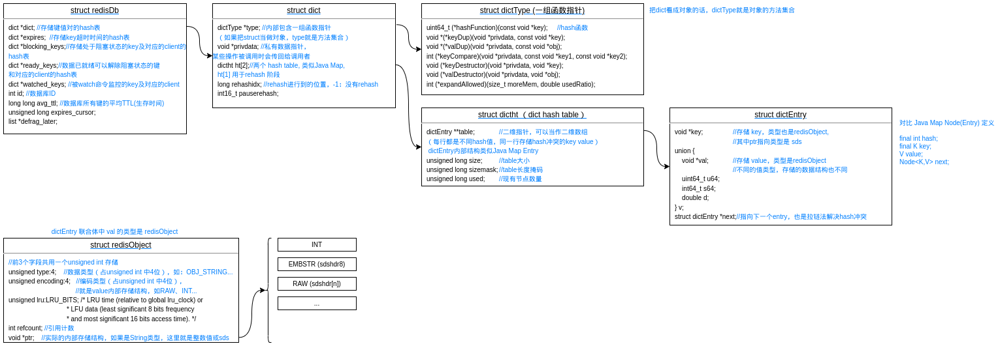
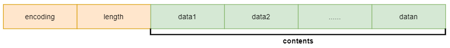
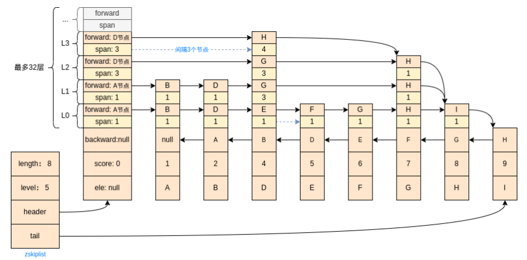

# Redis数据结构&内部实现原理

> 源码版本：Redis 6.2.6


## Redis数据类型与内部结构

### Redis数据类型

#### String、List、Set、ZSet、Hash

```C
#define OBJ_STRING 0    /* String object. */
#define OBJ_LIST 1      /* List object. */
#define OBJ_SET 2       /* Set object. */
#define OBJ_ZSET 3      /* Sorted set object. */
#define OBJ_HASH 4      /* Hash object. */
```

#### Bitmap

#### GenHash

#### HyperLogLog

#### Stream （5.0之后新增）


### **Redis重要结构体**



#### sds （Simple Dynamic String，5种类型）

是Redis自定义的字符串类型。

```C
//表面上看是个char指针类型，但是这里sds只是指向了sds的buf,通过指针下移一字节找到flag才能确定其真正的数据结构
typedef char *sds;
//typedef char *sds_buf;	//改成这个定义更好理解
```

索引为-1的位置上（flags）存储的是SDS的类型（有5中sds类型）:

```C
#define SDS_TYPE_5  0
#define SDS_TYPE_8  1
#define SDS_TYPE_16 2
#define SDS_TYPE_32 3
#define SDS_TYPE_64 4
#define SDS_TYPE_MASK 7

//1byte，flags低3位保存SDS类型，高5位保存字符串长度（最大长度63）
//buf是字符串内容
struct __attribute__ ((__packed__)) sdshdr5 {
    unsigned char flags; /* 3 lsb of type, and 5 msb of string length */
    char buf[];
};
//len: 1byte，低3位保存类型，高5位保存字符串长度，len是无符号char类型，即最大存储长度255
//alloc: 1byte, 用于记录还有多少空间可以使用 
//flag: 1byte，flags低3位保存SDS类型，高5位没有使用
//buf是字符串内容
struct __attribute__ ((__packed__)) sdshdr8 {
    uint8_t len; /* used */
    uint8_t alloc; /* excluding the header and null terminator */
    unsigned char flags; /* 3 lsb of type, 5 unused bits */
    char buf[];
};
//1byte，低3位保存类型，高5位保存字符串长度，len是无符号unsigned short int类型，即最大存储长度2^16-1
//1byte，flags低3位保存SDS类型，高5位没有使用
//buf是字符串内容
struct __attribute__ ((__packed__)) sdshdr16 {
    uint16_t len; /* used */
    uint16_t alloc; /* excluding the header and null terminator */
    unsigned char flags; /* 3 lsb of type, 5 unused bits */
    char buf[];
};
//1byte，低3位保存类型，高5位保存字符串长度，len是无符号unsigned int类型，即最大存储长度2^32-1
//1byte，flags低3位保存SDS类型，高5位没有使用
//buf是字符串内容
struct __attribute__ ((__packed__)) sdshdr32 {
    uint32_t len; /* used */
    uint32_t alloc; /* excluding the header and null terminator */
    unsigned char flags; /* 3 lsb of type, 5 unused bits */
    char buf[];
};
//1byte，低3位保存类型，高5位保存字符串长度，len是long long类型，即最大存储长度2^64-1
//1byte，flags低3位保存SDS类型，高5位没有使用
//buf是字符串内容
struct __attribute__ ((__packed__)) sdshdr64 {
    uint64_t len; /* used */
    uint64_t alloc; /* excluding the header and null terminator */
    unsigned char flags; /* 3 lsb of type, 5 unused bits */
    char buf[];
};
```

上面可以看到 flags 紧挨着 buf 定义，因为 robj 中 ptr 指针指向 buf , 要用 

```C
unsigned char flags = s[-1];
//将指针从buf向上移动，指向len,然后转换指针类型（如sdshdr8）
#define SDS_HDR(T,s) ((struct sdshdr##T *)((s)-(sizeof(struct sdshdr##T))))	//##是粘连符号
```

获取sds flag, 即SDS具体类型、甚至是字符串长度。


### Redis value 数据结构

```C
#define OBJ_ENCODING_RAW 0     /* Raw representation */
#define OBJ_ENCODING_INT 1     /* Encoded as integer */
#define OBJ_ENCODING_HT 2      /* Encoded as hash table */
#define OBJ_ENCODING_ZIPMAP 3  /* Encoded as zipmap */
#define OBJ_ENCODING_LINKEDLIST 4 /* No longer used: old list encoding. */
#define OBJ_ENCODING_ZIPLIST 5 /* Encoded as ziplist */
#define OBJ_ENCODING_INTSET 6  /* Encoded as intset */
#define OBJ_ENCODING_SKIPLIST 7  /* Encoded as skiplist */
#define OBJ_ENCODING_EMBSTR 8  /* Embedded sds string encoding */
#define OBJ_ENCODING_QUICKLIST 9 /* Encoded as linked list of ziplists */
#define OBJ_ENCODING_STREAM 10 /* Encoded as a radix tree of listpacks */
```

所有内部数据结构，最外层都是个redisObject。

查看对象内部编码数据结构类型：`object encoding key`。

#### INT

redisObject (详细介绍看下文) ptr 指针不存储地址，直接存储 value 转换后的数字；


0-10000 的值redis内部预先存储了，是可以共享使用的；

比如`set val 100` 这个100的存储结构是

```C
// 0-10000 redis预先设置好了，如存100
type = {unsigned int} 0
encoding = {unsigned int} 1
lru = {unsigned int} 7990932
refcount = {int} 2147483647
ptr = {void *} 0x64 
// 又比如100000
type = {unsigned int} 0
encoding = {unsigned int} 1
lru = {unsigned int} 8019551
refcount = {int} 1
ptr = {void *} 0x186a0 
```

#### EMBSTR


> 为何 EMBSTR 只能存储长度<=44的字符串？
>
> 内存IO每次访问数据的最小单位是缓存行（64byte），如果字符串长度足够小，完全可以只用一次IO完成 value 的访问，需要将redisObject 和 sdshdr8 存储到连续的内存，buf外其他字段占用总空间大小是 4+4+8+1+1+1=19, 留给buf 64-19=45bytes, 由于C语言数组存储字符串还要再最后存'\0'标识字符串结尾，占用1byte，最终最多只能存储长度为44的字符串。

#### RAW


相对于EMBSTR, RAW编码类型 redisObject 和 sds 存储在不连续的内存空间。

#### QUICKLIST


#### ZIPLIST


**ziplistNew**() 初始创建了11 bytes长的字符串，其中

zlbytes: 前4byte用于存储ZIPLIST总长度（初始是11bytes），

zltail: 紧接4byte存储最后一个数据项entry在ziplist中的偏移量（为了支持反向索引），

zlen: 再紧接着2byte存储ZIPLIST数据项entry长度，

zlend: 最后1byte存储255这个结尾标志；

HEADER（前10bytes） 和 END(最后1bytes) 之间存储数据。

prerawlen: 前一entry占用的数据长度（bytes，用于反向索引）；

len: 当前 entry 占用的数据长度以及数据类型。

> 数据存储紧凑，能转成整数的字符串会转成适当长度的整数存储。
>
> len编码格式：
>
> #define ZIP_STR_06B (0 << 6)
> #define ZIP_STR_14B (1 << 6)
> #define ZIP_STR_32B (2 << 6)
> #define ZIP_INT_16B (0xc0 | 0<<4)
> #define ZIP_INT_32B (0xc0 | 1<<4)
> #define ZIP_INT_64B (0xc0 | 2<<4)
> #define ZIP_INT_24B (0xc0 | 3<<4)
> #define ZIP_INT_8B 0xfe
> 还有一种 ZIP_INT_IMM，这里没列出来，1111xxxx, 将编码类型和data保存在一个字节中，只能存储-1到12这13个数字。11110001-11111101 分别对应的 data 是 -1-12。

#### HT

和外层数据结构一样（struct dict）。

#### INTSET



```C
//INTSET 数据结构, 就是个 signed char 数组
typedef struct intset {
    uint32_t encoding;	//有3种，
    					//#define INTSET_ENC_INT16 (sizeof(int16_t)) 两个contents节点表示一个元素
                        //#define INTSET_ENC_INT32 (sizeof(int32_t)) 四个
                        //#define INTSET_ENC_INT64 (sizeof(int64_t)) 八个
    uint32_t length;	//元素个数
    int8_t contents[];
} intset;
```

#### SKIPLIST

Redis中替代红黑树的一种实现。

**跳表的特点**（个人总结）：

+ 跳表各节点先按分值再按value正序排序；

+ span值记录从当前节点当前层到达同层下一节点的跨度（span: 跨度）；

  ```C
  //span值看代码不好理解，但是把各节点ZSkipListLevel[]打印出来看就好多了
  //DEMO:ZSkipListTest.java
  null  | 0.000000 | bw: null  	|0:1:A	|1:1:A	|2:3:D	|3:3:D	|4:3:D
  A     | 1.000000 | bw: null  	|0:1:B	|1:1:B
  B     | 2.000000 | bw: A     	|0:1:D	|1:1:D
  D     | 4.000000 | bw: B     	|0:1:E	|1:3:G	|2:3:G	|3:4:H
  E     | 5.000000 | bw: D     	|0:1:F
  F     | 6.000000 | bw: E     	|0:1:G
  G     | 7.000000 | bw: F     	|0:1:H	|1:1:H	|2:1:H
  H     | 8.000000 | bw: G     	|0:1:I
  I(tail)| 9.000000 | bw: H  
  ```

 * header节点是一个独立的节点不保存数据和分数，只是记录每层按正序排列的第一个节点，以及到达该节点要跨越的节点数；
 * tail节点指向最后一个元素，没有元素则tail指向 null。

**原理示意图：**

没找到画得好的图，然后自己重新画了一张。



```C
typedef struct zset {
    dict *dict;		//一个hash表,存 value->score
    zskiplist *zsl;	//一个跳表
} zset;

typedef struct zskiplist {
    struct zskiplistNode *header, *tail;
    unsigned long length;	//节点个数
    int level;				//当前最高level值
} zskiplist;

typedef struct zskiplistNode {	//跳表的节点
    sds ele;						//value的内容，sds类型
    double score;					//value的分值
    struct zskiplistNode *backward;	//一个后向指针
    struct zskiplistLevel {			//多个前向指针
        struct zskiplistNode *forward;
        unsigned long span;
    } level[];
} zskiplistNode;
```

#### ZIPMAP

#### LINKEDLIST

#### STREAM

### 数据类型与内部数据结构对应关系

| 外部数据类型 | 内部存储结构                                                 |
| ------------ | ------------------------------------------------------------ |
| String       | **INT** / **EMBSTR** / **RAW**                               |
| List         | **QUICKLIST + ZIPLIST**                                      |
| Set          | **INTSET** / **HT** (struct dict, 这里存的是空值)            |
| ZSet         | **ZIPLIST** (数量较少时) / **HT** (存储value->score) + **SKIPLIST** (支持用score查value)<br />即通过 HT 和 SKIPLIST 分别支持 value -> score 和 score -> value 的双向查找 |
| Hash         | **ZIPLIST** (数量较少时) / **HT**                            |
| Bitmap       |                                                              |
| GenHash      |                                                              |
| HyperLogLog  |                                                              |
| Stream       |                                                              |


## String

以`set`命令为例。

```shell
SET key value [NX] [XX] [KEEPTTL] [GET] [EX <seconds>] [PX <milliseconds>] [EXAT <seconds-timestamp>][PXAT <milliseconds-timestamp>]
```

源码处理流程:

1. 调用栈

   ```c
   setCommand t_string.c:266	//进入string set 命令处理逻辑
   call server.c:3721
   processCommand server.c:4241
   processCommandAndResetClient networking.c:2039
   processInputBuffer networking.c:2140
   readQueryFromClient networking.c:2226
   callHandler connhelpers.h:79
   connSocketEventHandler connection.c:295
   aeProcessEvents ae.c:427
   aeMain ae.c:487				//event loop 监听客户端命令
   main server.c:6401
   ```

2. set命令处理分析

   代码不直观，所以根据源码逻辑画了个图 （流程图：redis-ds-process.drawio）

   
   
   hash算法 与 value索引：

   ```C
   uint64_t siphash(const uint8_t *in, const size_t inlen, const uint8_t *k) {
   	...
   }
   
   //从dict索引key对应的值（按key查超时时间、按key查value值 都是这个逻辑）
   h = dictHashKey(d, key);
   for (table = 0; table <= 1; table++) {
       idx = h & d->ht[table].sizemask;	//即按sizemask对key的hash值求模
       he = d->ht[table].table[idx];		//拉取一行(hash求模相同的所有key)
       while(he) {							//链表遍历，查找目标key
           if (key==he->key || dictCompareKeys(d, key, he->key))
               return he;
           he = he->next;
       }
       if (!dictIsRehashing(d)) return NULL;	//如果正在rehash,且在ht[0]中没有查找到key,再去ht[1]查一下，
       										//参考rehash机制
   }
   ```
   
   

## List

以`rpush`命令为例：

```shell
 RPUSH <key> <element> [<element> ...]
```

命令处理函数：

```C
void rpushCommand(client *c) 
```

源码 rpush 处理流程:


## Hash

以`hset`命令为例，命令处理函数：

```C
void hsetCommand(client *c)
```

处理流程和前面的都一样，不想画图了：

1. 先查最外层hash表key是否存在，存在则返回，不存在则创建Hash类value对象，然后将key-value存入选定数据库的最外层hash结构；

   ```C
   robj *o = lookupKeyWrite(c->db,key);
   o = createHashObject();	//value对象指针
   dbAdd(c->db,key,o);
   ```

   初始创建的 Hash value 对象也是 ziplist 数据结构。

   ```C
   unsigned char *zl = ziplistNew();//value对象的内部数据结构（*ptr）
   robj *o = createObject(OBJ_HASH, zl);
   o->encoding = OBJ_ENCODING_ZIPLIST;
   ```

   > ZIPLIST 数据结构决定了其索引效率很低，为何还能做Hash类型的内部数据结构？主要是源码限制了数据量很少的前提下才能用 ZIPLIST，后面有3个限制，任何一个条件不满足都会转成 HT 类型。
   >
   > 1）key value 单个参数字符串长度大于hash_max_ziplist_value (默认64bytes)
   >
   > 2）ZIPLIST 中 entry 数量超过 hash_max_ziplist_entries （默认512）
   >
   > 3）加上本次新增key value 存储总长超过1<<30字节，即1GB （有前两个条件限制这个其实根本无法出现）
   >
   > 搜索 hashTypeConvert(o, OBJ_ENCODING_HT) 这个方法都在哪里调用的，就能找到这三个限制条件。

2. 如果传入的key value参数，单个参数字符串长度大于64，或ziplist无法安全的新增数据（加上本次新增key value总长超过1<<30字节，即1GB， ？为何是1GB ？），将把 value 对象（redisObject指针）转成 **OBJ_ENCODING_HT** 类型；

   ```C
   void hashTypeConvertZiplist(robj *o, int enc) {
       serverAssert(o->encoding == OBJ_ENCODING_ZIPLIST);
   
       if (enc == OBJ_ENCODING_ZIPLIST) {
           /* Nothing to do... */
   
       } else if (enc == OBJ_ENCODING_HT) {
           hashTypeIterator *hi;
           dict *dict;
           int ret;
   
           hi = hashTypeInitIterator(o);
           dict = dictCreate(&hashDictType, NULL);	//为
   
           while (hashTypeNext(hi) != C_ERR) {
               sds key, value;
   
               key = hashTypeCurrentObjectNewSds(hi,OBJ_HASH_KEY);
               value = hashTypeCurrentObjectNewSds(hi,OBJ_HASH_VALUE);
               ret = dictAdd(dict, key, value);
               if (ret != DICT_OK) {
                   serverLogHexDump(LL_WARNING,"ziplist with dup elements dump",
                       o->ptr,ziplistBlobLen(o->ptr));
                   serverPanic("Ziplist corruption detected");
               }
           }
           hashTypeReleaseIterator(hi);
           zfree(o->ptr);
           o->encoding = OBJ_ENCODING_HT;
           o->ptr = dict;	//即内部数据结构也是 struct dict
       } else {
           serverPanic("Unknown hash encoding");
       }
   }
   ```

3. 将 value参数数据存入Hash value 对象。

   ```C
   int hashTypeSet(robj *o, sds field, sds value, int flags)
   ```

   

## Set

以`sadd`命令为例，命令处理函数：

```C
saddCommand(client *c)
```

源码处理流程：

外层数据结构处理还是一样，然后看内部数据结构：

```C
//value 数据结构创建
robj *setTypeCreate(sds value) {
    if (isSdsRepresentableAsLongLong(value,NULL) == C_OK)	//如果可以用整型表示
        return createIntsetObject();						//就用IntSet数据结构
    return createSetObject();	//否则用Set数据结构
}
//INTSET 数据结构, 就是个 signed char 数组
typedef struct intset {
    uint32_t encoding;	//有3种，
    					//#define INTSET_ENC_INT16 (sizeof(int16_t)) 两个contents节点表示一个元素
                        //#define INTSET_ENC_INT32 (sizeof(int32_t)) 四个
                        //#define INTSET_ENC_INT64 (sizeof(int64_t)) 八个
    uint32_t length;	//元素个数
    int8_t contents[];
} intset;
//Set数据结构, 就是 struct dict, 就是 OBJ_ENCODING_HT
dict *dictCreate(dictType *type,
        void *privDataPtr)
{
    dict *d = zmalloc(sizeof(*d));
    _dictInit(d,type,privDataPtr);
    return d;
}
```

当 INTSET entry数量 > set_max_intset_entries (默认512, 最大1<<30) ，或者当前正在使用 INTSET 数据结构但是新增的数据不能用整数表示都会转成 HT 数据结构。

```
size_t max_entries = server.set_max_intset_entries;
/* limit to 1G entries due to intset internals. */
if (max_entries >= 1<<30) max_entries = 1<<30;
if (intsetLen(subject->ptr) > max_entries)
	setTypeConvert(subject,OBJ_ENCODING_HT);
```


## ZSet

以`zadd`命令为例

```shell
ZADD key [NX | XX] [GT | LT] [CH] [INCR] score member [score member ...]
XX: 仅仅更新存在的成员，不添加新成员。
NX: 不更新存在的成员。只添加新成员。
CH: (changed)修改返回值为发生变化的成员总数，原始是返回新添加成员的总数 (CH 是 changed 的意思)。
更改的元素是新添加的成员，已经存在的成员更新分数。 所以在命令中指定的成员有相同的分数将不被计算在内。
注：在通常情况下，ZADD返回值只计算新添加成员的数量。
INCR: 当ZADD指定这个选项时，成员的操作就等同ZINCRBY命令，对成员的分数进行递增操作。
GT: (great than) 只有当新分值大于旧分值时才更新，key不存在则直接添加。
LT: (little than)只有当新分值小于旧分值时才更新，key不存在则直接添加。
```

命令处理函数：

```C
zaddCommand(client *c)
```

源码处理流程：


当配置参数 **zset_max_ziplist_entries = 0** 或 **zset_max_ziplist_value < value值的长度** 时，采用 struct zset 数据结构存储数据，另外插入值时也可能将 ziplist 转成 zset，即 **ziplist entry 个数大于 zset_max_ziplist_entries** 或 **单个value长度 大于 zset_max_ziplist_value** 或 **加上新的value,ziplist总长度超过 1<<30 bytes即1GB** ：

```C
//ziplist entry 个数大于 zset_max_ziplist_entries，
//或 单个value长度 大于 zset_max_ziplist_value，
//或 加上新的value,ziplist总长度超过 1<<30 bytes即1GB
if (zzlLength(zobj->ptr)+1 > server.zset_max_ziplist_entries ||
    sdslen(ele) > server.zset_max_ziplist_value ||
    !ziplistSafeToAdd(zobj->ptr, sdslen(ele)))
{
    zsetConvert(zobj,OBJ_ENCODING_SKIPLIST);
}
//注意当删除元素后上面三个条件都满足还会将 zset 转成 ziplist
```

zset数据结构（其实就是个多叉树）：

```C
typedef struct zset {
    dict *dict;		//一个hash表
    zskiplist *zsl;	//一个跳表
} zset;

typedef struct zskiplist {
    struct zskiplistNode *header, *tail;
    unsigned long length;
    int level;
} zskiplist;

typedef struct zskiplistNode {	//跳表的节点
    sds ele;						//value的内容，sds类型
    double score;					//value的分值
    struct zskiplistNode *backward;	//一个后向指针
    struct zskiplistLevel {			//多个前向指针
        struct zskiplistNode *forward;
        unsigned long span;
    } level[];
} zskiplistNode;
```

数据结构类型转换：

比如新建一个zset key `zadd azset NX CH 1 A`，则 value redisObject 的 ptr 指针指向一个 ziplist; 

其内部存储数据为(value和score分别作为一个entry存储，下图v为 value entry（'A'），s为 score entry(1) )

| zlbytes(4) | zltail(4) | zllen（2） | v-prerawlen | v-len    | v-content | s-prerawlen | s-(len+data) | zlend(1) |
| ---------- | --------- | ---------- | ----------- | -------- | --------- | ----------- | ------------ | -------- |
| 16         | 13        | 2          | 0           | 00000001 | 'A'       | 3           | 11110010B    | 255      |

> (unsigned char *)(zl+10) v-prerawlen指针
>
> (unsigned char *)(zl+11) v-len指针
>
> (unsigned char *)(zl+12) v-content指针
>
> (unsigned char *)(zl+13) s-prerawlen指针
>
> 关于 score 在 ziplist 中的存储方法，参考 t_zset.c `unsigned char *zzlInsert(unsigned char *zl, sds ele, double score)` 函数; 由于这里 score=1, 在[1,13]之间，采用 ZIP_INT_IMM 编码格式。

```C
//ZSET 内部存储数据结构 ZIPLIST 与 SKIPLIST 的相互转换
void zsetConvert(robj *zobj, int encoding) {
    zset *zs;
    zskiplistNode *node, *next;
    sds ele;
    double score;

    if (zobj->encoding == encoding) return;
    if (zobj->encoding == OBJ_ENCODING_ZIPLIST) {	//SKIPLIST -> ZIPLIST
        unsigned char *zl = zobj->ptr;
        unsigned char *eptr, *sptr;
        unsigned char *vstr;
        unsigned int vlen;
        long long vlong;

        if (encoding != OBJ_ENCODING_SKIPLIST)
            serverPanic("Unknown target encoding");
		
        //分配SKIPLIST内部空间
        zs = zmalloc(sizeof(*zs));
        zs->dict = dictCreate(&zsetDictType,NULL);	//用于存储 value 的 score, value->score
        zs->zsl = zslCreate();

        //找到ZIPLIST中第一个entry的指针（第一个value） (unsigned char *)(zl+10)
        eptr = ziplistIndex(zl,0);
        serverAssertWithInfo(NULL,zobj,eptr != NULL);
        //第一个value的score指针，是紧挨着value entry 的下一个entry
        sptr = ziplistNext(zl,eptr);
        serverAssertWithInfo(NULL,zobj,sptr != NULL);

        //递归遍历所有 ZIPLIST entry
        while (eptr != NULL) {
            score = zzlGetScore(sptr);
            serverAssertWithInfo(NULL,zobj,ziplistGet(eptr,&vstr,&vlen,&vlong));
            if (vstr == NULL)
                ele = sdsfromlonglong(vlong);
            else
                ele = sdsnewlen((char*)vstr,vlen);
			//插入跳表
            node = zslInsert(zs->zsl,score,ele);
            serverAssert(dictAdd(zs->dict,ele,&node->score) == DICT_OK);
            zzlNext(zl,&eptr,&sptr);
        }

        zfree(zobj->ptr);
        zobj->ptr = zs;
        zobj->encoding = OBJ_ENCODING_SKIPLIST;
    } else if (zobj->encoding == OBJ_ENCODING_SKIPLIST) {	//ZIPLIST -> SKIPLIST
        unsigned char *zl = ziplistNew();

        if (encoding != OBJ_ENCODING_ZIPLIST)
            serverPanic("Unknown target encoding");

        /* Approach similar to zslFree(), since we want to free the skiplist at
         * the same time as creating the ziplist. */
        zs = zobj->ptr;
        dictRelease(zs->dict);
        node = zs->zsl->header->level[0].forward;
        zfree(zs->zsl->header);
        zfree(zs->zsl);

        while (node) {
            zl = zzlInsertAt(zl,NULL,node->ele,node->score);
            next = node->level[0].forward;
            zslFreeNode(node);
            node = next;
        }

        zfree(zs);
        zobj->ptr = zl;
        zobj->encoding = OBJ_ENCODING_ZIPLIST;
    } else {
        serverPanic("Unknown sorted set encoding");
    }
}
```


## Bitmap


