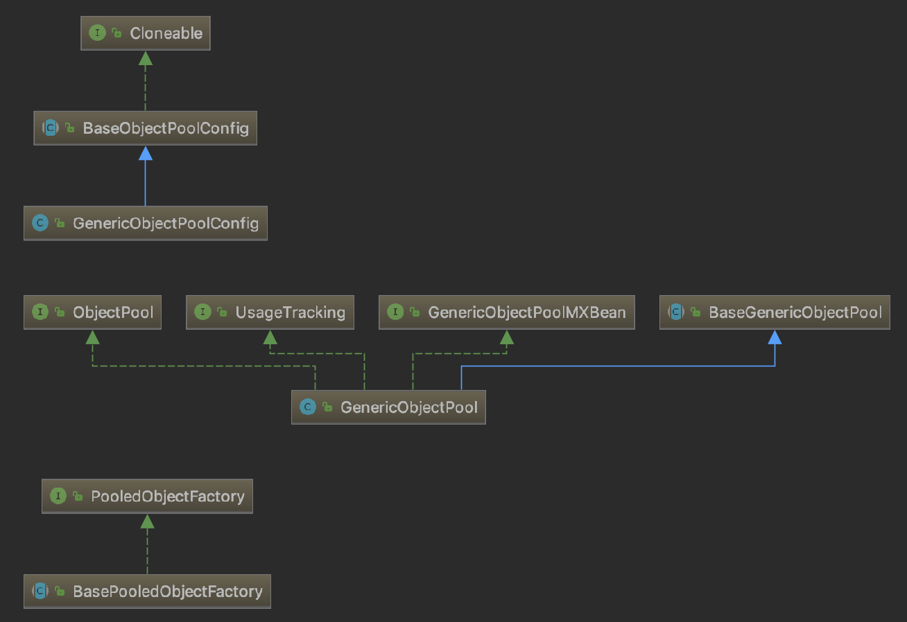

# Jedis源码解析与IO多路复用

## 客户端与服务端连接流程

## JedisPool实现原理

JedisPool 依赖于 Apache commons-pool2 中对象池的实现。
        
### Apache Common-pool2 对象池技术
    
Common-pool2是一个通用的对象池技术实现，可以很方便用来实现自己的对象池，除了Redis，
其他框架如DBCP也有使用Common-pool2实现自己的对象池。

Eviction 翻译为驱逐，在这里可能更合适。

适用场景：线程、网络连接、数据库连接等。

分析 Commons-pool2 首先从一个简单的Demo开始。参考测试代码 top.kwseeker.commandline.single.pool.CommonPool2Test。
   
GenericObjectPool 是对象池的主体实现，  
GenericObjectPoolConfig 是对象池配置，  
BasePooledObjectFactory 是抽象类由用户实现具体方法，用于创建存储于对象池的对象。  
IdentityWrapper 本质上是PooledObject对象的Hash索引。  
DefaultPooledObject 池化对象实现，只是添加了一些记录池化操作的属性。  
PooledObjectState 池化对象状态（IDLE：空闲，ALLOCATED：使用中，EVICTION：正在检测泄漏可能被回收，
    EVICTION_RETURN_TO_HEAD, VALIDATION, VALIDATION_PREALLOCATED, VALIDATION_RETURN_TO_HEAD, 
    INVALID, ABANDONED, RETURNING）  

池化对象的状态转换（TODO：这个状态转换是对象池工作流程的剪影）  


GenericObjectPool
```
// 
private volatile String factoryType = null;
// 最大空闲对象数(default:8)
private volatile int maxIdle = GenericObjectPoolConfig.DEFAULT_MAX_IDLE;
// 最小空闲对象数(default:0)
private volatile int minIdle = GenericObjectPoolConfig.DEFAULT_MIN_IDLE;
// 池化对象工厂
private final PooledObjectFactory<T> factory;
// 创建的所有的池化对象都存储在ConcurrentHashMap中
private final Map<IdentityWrapper<T>, PooledObject<T>> allObjects = new ConcurrentHashMap<IdentityWrapper<T>, PooledObject<T>>();
// 创建对象计数，每创建一个对象+1
private final AtomicLong createCount = new AtomicLong(0);
// 所有空闲的对象存储在 LinkedBlockingDeque 中
private final LinkedBlockingDeque<PooledObject<T>> idleObjects;
// 泄漏清理操作的配置（泄漏判断时间removeAbandonedTimeout单位s）（默认null）
private volatile AbandonedConfig abandonedConfig = null;

// Configuration attributes
// 最大对象数
private volatile int maxTotal = GenericKeyedObjectPoolConfig.DEFAULT_MAX_TOTAL;
// 对象用尽是否阻塞，不阻塞的化应该回返回异常
private volatile boolean blockWhenExhausted = BaseObjectPoolConfig.DEFAULT_BLOCK_WHEN_EXHAUSTED;
// 阻塞等待获取对象的时间 -1 无限等待
private volatile long maxWaitMillis = BaseObjectPoolConfig.DEFAULT_MAX_WAIT_MILLIS;
// 默认后进先出
private volatile boolean lifo = BaseObjectPoolConfig.DEFAULT_LIFO;
// 默认非公平模式
private final boolean fairness;

// 对象创建时测试（default:false）
private volatile boolean testOnCreate = BaseObjectPoolConfig.DEFAULT_TEST_ON_CREATE;
// 对象被引用时测试
private volatile boolean testOnBorrow = BaseObjectPoolConfig.DEFAULT_TEST_ON_BORROW;
// 对象被返回时测试
private volatile boolean testOnReturn = BaseObjectPoolConfig.DEFAULT_TEST_ON_RETURN;
// 对象闲置时测试
private volatile boolean testWhileIdle = BaseObjectPoolConfig.DEFAULT_TEST_WHILE_IDLE;
// 对象回收线程执行间隔，-1表示不执行回收线程
private volatile long timeBetweenEvictionRunsMillis = BaseObjectPoolConfig.DEFAULT_TIME_BETWEEN_EVICTION_RUNS_MILLIS;
// 每次执行回收测试的次数 3
private volatile int numTestsPerEvictionRun = BaseObjectPoolConfig.DEFAULT_NUM_TESTS_PER_EVICTION_RUN;
//
private volatile long minEvictableIdleTimeMillis = BaseObjectPoolConfig.DEFAULT_MIN_EVICTABLE_IDLE_TIME_MILLIS;
//
private volatile long softMinEvictableIdleTimeMillis = BaseObjectPoolConfig.DEFAULT_SOFT_MIN_EVICTABLE_IDLE_TIME_MILLIS;
// 对象回收策略
private volatile EvictionPolicy<T> evictionPolicy;

final Object closeLock = new Object();
//对象池关闭状态（默认false，未关闭）
volatile boolean closed = false;
final Object evictionLock = new Object();
//回收线程，异步执行
private Evictor evictor = null; // @GuardedBy("evictionLock")
//空闲对象的迭代器
EvictionIterator evictionIterator = null; // @GuardedBy("evictionLock")
private final WeakReference<ClassLoader> factoryClassLoader;

// Monitoring (primarily JMX) attributes
private final ObjectName oname;
private final String creationStackTrace;
private final AtomicLong borrowedCount = new AtomicLong(0);
private final AtomicLong returnedCount = new AtomicLong(0);
final AtomicLong createdCount = new AtomicLong(0);
final AtomicLong destroyedCount = new AtomicLong(0);
final AtomicLong destroyedByEvictorCount = new AtomicLong(0);
final AtomicLong destroyedByBorrowValidationCount = new AtomicLong(0);
private final StatsStore activeTimes = new StatsStore(MEAN_TIMING_STATS_CACHE_SIZE);
private final StatsStore idleTimes = new StatsStore(MEAN_TIMING_STATS_CACHE_SIZE);
private final StatsStore waitTimes = new StatsStore(MEAN_TIMING_STATS_CACHE_SIZE);
private final AtomicLong maxBorrowWaitTimeMillis = new AtomicLong(0L);
private volatile SwallowedExceptionListener swallowedExceptionListener = null;
```
1）对象池初始化  
    开启JMX监控；初始化将要池化的对象容器；设置一些配置项；设置并启动泄漏回收器。  
    
2）borrowObject()  
    2.1) 校验一下池是否开启(初始化后默认开启)；  
    2.2) 如果设置了泄漏清理配置，且使能了当从池中借用对象的时候检测泄漏清理的标志，则判断当前空闲对象是否快被用完以及激活数是否快达到池的最大容量，
    是的化则执行检测回收操作；  
    3.3) 从池中取对象，
          blockWhenExhausted = true, 从idleObjects（LinkedBlockingDeque）中 pollFirst(),取不到就"尝试"创建一个池化对象；
          如果还是取不到，则阻塞等待直到双端队列中有对象可取或者超时，对于有超时等待的取超时取不到抛异常；
          取成功后要修改池化对象DefaultPooledObject的状态标志。
          blockWhenExhausted = false, 没有上面阻塞等待获取的过程，其他都一样。  
    3.4) 设置一下后续的状态标志。  

3）returnObject()  
    3.1) 获取对象状态并检查，不是ALLOCATED，抛出异常；  
    3.2) 修改对象状态为RETURNING；  
    3.3) 如果设置了testOnReturn = true，还需要通过validateObject()校验对象的有效性；  
    3.4) 修改其他一些状态标志；  
    3.5) 将对象放回idleObjects队列中（不是allObjects队列），放入头部还是尾部，有lifo决定。
          注意对象的取出放回并不是向队列添加或删除，而是设置标示取出或放回的状态。 